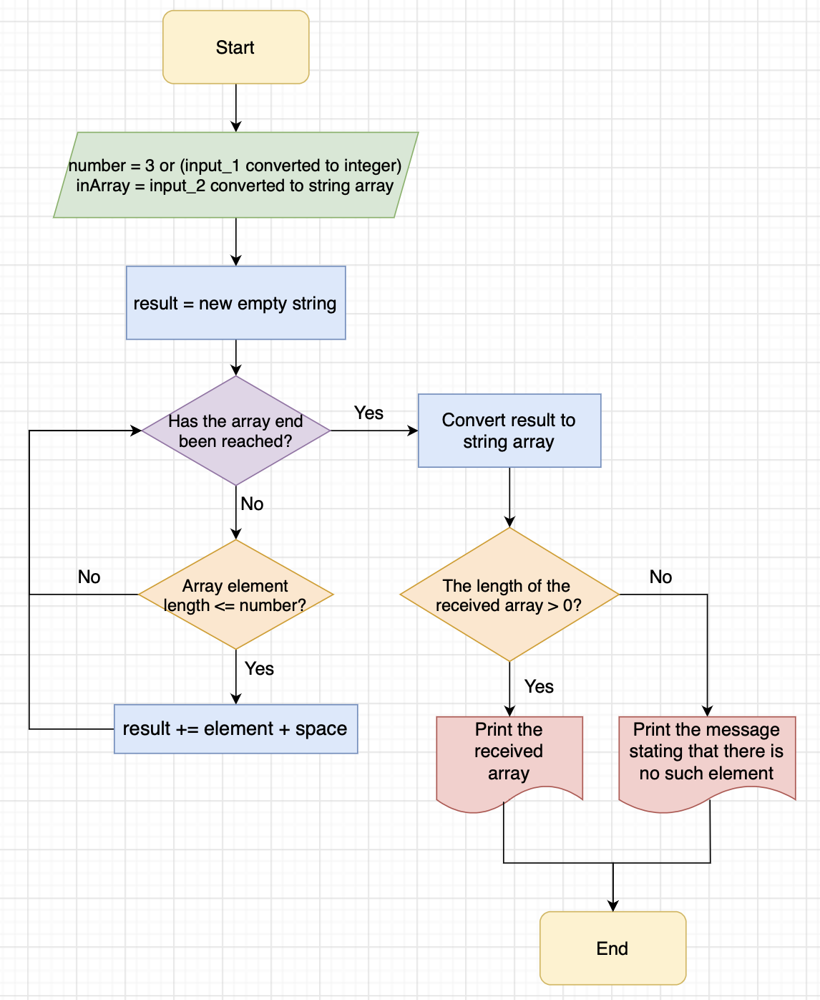

1. Пользователь задает количество символов в элементах, которые хочет найти либо принимает значение по умолчанию, равное 3.
2. Пользователь задает значение элементов массива в строку через пробелы.
3. Строка преобразуется в массив строк.
4. Метод №1:
    * Метод принимает на вход заданный массив и заданное число символов в искомом элементе возвращает массив строк.
    * Создается новая переменная - пустая строка (result).
    * Элементы в заданном массиве перебираются при помощи цикла и их длина сравнивается с заданным числом.
    * Если длина элемента меньше или равна заданному числу, то элемент добавляется в созданную строку (result). Дополнительно добавляется пробел, чтобы элементы в строке были разделены пробелами, для последующего преобразования строки в массив.
    * Полученная строка result преобразуется в массив строк и возвращается методом.

5. Метод №2:
    * Метод принимает на вход заданный массив и заданное число символов в искомом элементе возвращает массив строк.
    * Создается новая целочисленная переменная (count).
    * Элементы в заданном массиве перебираются при помощи цикла и их длина сравнивается с заданным числом.
    * Если длина элемента меньше или равна заданному числу, то к созданной переменной (count) прибавляется единица. Таким образом считается количество удовлетворяющих условиям элементов в заданном массиве.
    * Создается новый массив строк (result) длиной count.
    * Элементы заданного массива перебираются циклом еще раз и элементам массива result по очереди присваиваются значения удовлетворяющих условиям элементов. Для этого используется вспомогательная переменная j, которая используется для обозначения индекса элемента в массиве count и при каждом новом присвоении увеличивается на 1.
    * Полученный массив result возвращается методом.
6. Метод №3:
    * Метод принимает на вход заданный массив и заданное число символов в искомом элементе возвращает массив строк.
    * Создается новый пустой список (temp)
    * Элементы в заданном массиве перебираются при помощи цикла и их длина сравнивается с заданным числом.
    * Если длина элемента меньше или равна заданному числу, то найденный элемент добавляется в список temp.
    * Создается новый массив строк (result), равный по длине списку temp.
    * Список temp копируется в массив result.
    * Массив result возвращается методом.
7. Если итоговый массив пустой, то в консоль выводится сообщение, что элементов, удовлетворяющих условиям, не найдено. Иначе - выводится полученный массив.

P.S. Блок-схему алгоритма составил только для первого метода.
